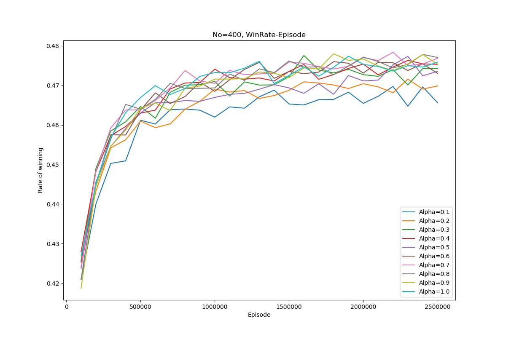
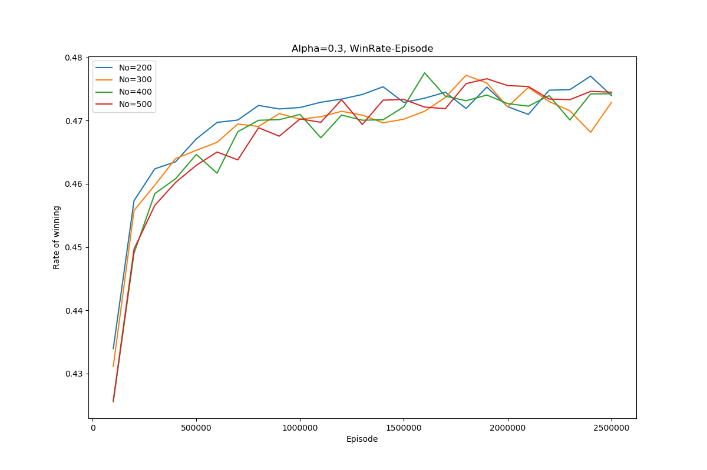

# Easy-21

## Introduction

Easy-21 is a single-player game evolving from Blackjack. The main differences between Easy-21 and Blackjack are:

- There are only two players, you and the dealer.
- There are two types of card：red card (1/3) and black card (2/3). Red card has negative points while black card has positive points. 
- Underflow card blasting (because of red cards)

State $s=(p_d,p_p)$, where $p_d$ is the dealer's point, $p_p$ is the player's point. State Space $\mathcal{S}=\{1,2,\cdots,10\}\times\{1,2,\cdots,21\}$ .

Action $a\in\{0,1\}$, $0$ means Hit, $1$ means Stick.

## Q-learning

### Algorithm

**Update Equation**

$$Q_{t+1}(s,a)=Q_t(s,a) + \alpha\cdot[R(s,a,s')+\gamma\cdot\max_{a}Q_t(s',a)-Q_t(s,a)]$$

**Process**

- Initialization: For all $a\in\mathcal{A}, s\in\mathcal{S}$, assign a value to $Q(s,a)$ arbitrarily.
- Sampling: Generate training data (a set of $(s,a,s')$) through simulating Easy-21 game. 

- Update: Using the training data to update the $Q$ function according to the update equation.

**Implement**

Here is [our code](https://github.com/lym01803/Easy21-D24616/tree/master/QLearning) for Easy-21 game using Q-learning method.

### Experiment

**Exploration and exploitation**

There are many method to balance exploration and exploitation , and we have attempted some:

- $\epsilon$-greedy : Take best action (according to current Q value) with a probability of $1-\epsilon$, and take random action (must be valid) with a probability of $\epsilon$ .
- Take action according to the probability distribution: $P(a|s,Q)=\dfrac{e^{Q(s,a)/\tau}}{\sum_{a\in\mathcal{A}}e^{Q(s,a)/\tau}}$ , where $\tau$ is a positive const number.
- Take the best action (according to current Q value) with a probability of $1-\dfrac{n}{N(s)+n}$, and take random action (must be valid) with a probability of $\dfrac{n}{N(s)+n}$, where $n$ is a positive const number, and $N(s)$ means the number of times that $s$ has been visited. In other words,  every state has its own $\epsilon$ and the $\epsilon$ here is variable (the more times $s$ is visited, the smaller $\epsilon$ is) .

We mainly show the result of the third method.

**Learning rate**

We consider two method :

- Using a fixed learning rate all the time and for all the $(s,a)$.

- Make learning rate variable, and every $(s,a)$ has its own learning rate according to the visit times, $\alpha(s,a)=\dfrac{\alpha_0}{N(s,a)}$ .

The second method is better. We mainly show the result of the second one. 

#### $\frac{n}{N(s)+n}$-greedy

##### Fixed $n$

With 2.5M episodes:

<table>
    <tr>
        <td></td>
        <td></td>
    </tr>
</table>
<table>
    <tr>
        <td></td>
        <td></td>
    </tr>
</table>
<table>
	<tr>
        <td></td>
        <td>
    </tr>
</table>
<table>
    <tr>
    	<td></td>
        <td></td>
    </tr>
</table>

The left column shows the average win rate of the recent $100k$ episodes, and the right column shows the average win rate of all the episodes from the beginning.

From the graphs above, we find $\alpha\approx0.5$ performs well. When the learning rate is too high, for example $\alpha=1.0$, the win rate go up quickly in the early stages because it learns from episodes quickly. However the final win rate is relatively low, because a model with higher learning rate are more sensitive to the noise data. When the learning rate is too low, for example $\alpha=0.1$, the model learning slowly and the win rate is low. We are going to test $\alpha=0.3,0.5,0.7$ then.

**Fixed $\alpha$**

With 2.5M episodes:

<table>
    <tr>
    	<td></td>
        <td></td>
    </tr>
</table>
<table>
    <tr>
    	<td></td>
        <td></td>
    </tr>
</table>
<table>
    <tr>
    	<td>
        <td></td>
    </tr>
</table>

The left column shows the average win rate of the recent $100k$ episodes, and the right column shows the average win rate of all the episodes from the beginning.

A higher $n$ leads to more exploration while a lower $n$ leads to more exploitation. We find that when $\alpha$ is fixed, $n=200$ or $n=300$ performs well. 

#### Set $\alpha=0.5$, $n=300$, train with 10M episodes

##### The final win rate

We test the model with 10M episodes, it wins in 4783569 episodes, loses in 5009724 episodes and tie in 206707 episodes.

Win rate: $47.8\%$  

 ##### The graph of $\max_aQ(s,a)$

## Policy Iteration

### Algorithm

**Bellman Equation**

$$V(s)=\max_a \sum_{s'\in\mathcal{S}}P(s'|s,a)[R(s,a,s')+\gamma V(s')]$$

$\pi(s)=\mathtt{argmax}_a \sum_{s'\in\mathcal{S}}P(s'|s,a)[R(s,a,s')+\gamma V(s')]$

**Process**

- Preparation:
  - Calculate $P(s'|s,a)$. We use simulation to get the distribution.
- Initialization: Assign a random value to $V(s)$ and $\pi(S)$ for every $s$. 
- According to current $V$, update the policy $\pi$, and count the unstable states.
- If there is any unstable state, evaluate $V$ according to current $\pi$.
- The iteration will be executed until the policy $\pi$ is convergent.

**Implement**

Here is [our code](https://github.com/lym01803/Easy21-D24616/tree/master/Policy) for Easy-21 game using Policy Iteration method.

### Experiment

The policy iteration has a very clear training process and almost no hyper-parameter.

In our experiment, the policy iteration method becomes to be convergent in only 5 iteration.

| Iteration | Unstable |
| --------- | -------- |
| 1         | 104      |
| 2         | 46       |
| 3         | 7        |
| 4         | 1        |
| 5         | 0        |

#### Graph of $V(s)$

Quite similar to the one of Q-learning, but a little more smooth.

#### Win Rate

Test with 10M episodes, win in 4787639 episodes, lose in 5002949 episodes and tie in 209412 episodes.

Win rate: $47.9\%$

## Comparison
**Action policy**

<table>
    <tr>
    	<td>Q-Learning</td> <td>Policy Iteration</td>
    </tr>
    <tr>
    	<td></td>
        <td></td>
    </tr>
</table>

$x-axis$: Dealer's points.

$y-axis$: Your current points.

$0$ : Hit.

$1$ : Stick.  

Obviously, the graph got from Policy Iteration is more regular. My intuition tells me that the more regular solution got from Policy iteration is better than the one got from Q-learning. And the win rate of Policy Iteration is a little higher than that of Q-learning.

**Training time**

The Policy Iteration becomes convergent after only 5 iterations. In every iteration, it traverses all the state space and action space twice (once in updating $\pi$ and once in evaluating $V$). In this Easy-21 problem, the Policy Iteration performs well and train the model in a very short time.

The Q-learning method converge slowly so we should set a max iteration times for it. In our experiment, we train the Q-learning model on 2.5M or 10M episodes, which takes a much longer time than training with Policy Iteration method.

**Some properties**

Training with Policy Iteration method, we need to know the transition probability distribution $P(s'|s,a)$, while Q-learning method does not require this imformation. In Easy-21 we get the distribution easily by simulation, but if we are training for another more complex problem, it may be difficult or even impossible to get the distribution. So Q-learning has advantages in this aspect.

Policy Iteration need to traverse all the state space and action space. So if the state space and action space are large, it may be expensive to train with Policy Iteration. Q-learning does not need to traverse all the state space and action space. It mainly focus on the local space which the optimal solution are likely located in. 

